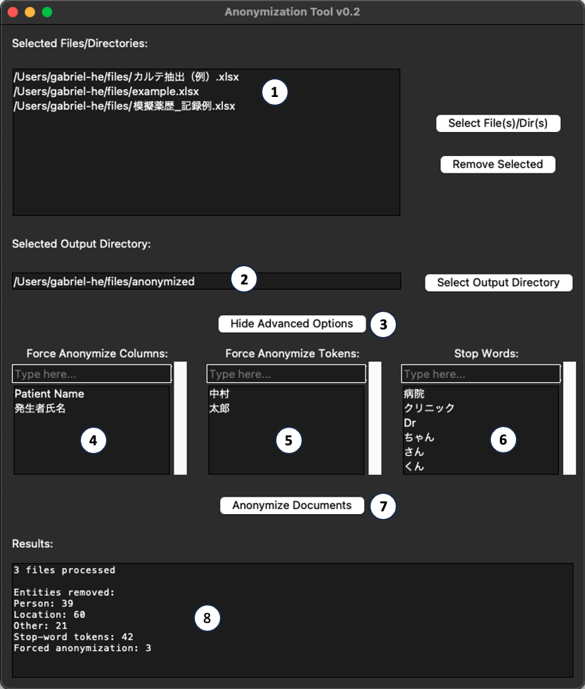

# AnonymizationTool

A simple Anonymization Tool for Japanese texts. 

It uses [Ginza](https://github.com/megagonlabs/ginza) POS tagging to identify potential `Proper Nouns` and replace those
with a `[ANON]` tag.

The method was specifically tunned to anonymize Japanese clinical texts, aiming to remove patient and doctor personal
information, such as names and addresses, and also institution (hospital, clinic) names and locations.

Currently, this software only supports Excel (.xls/xlsx) files as input.

## Execution

### Windows

A setup file is provided in the [Releases](https://github.com/gabrielandrade2/AnonymizationTool/releases/latest)
section.
This installer packs all required dependencies (including Python).
After installation, the program can be executed from the start menu or the desktop shortcut.

### The python way (Linux, Mac, Windows)

It can be executed in two main ways currently:

- Executing `gui.py` will initialize a gui to select files and define the parameters
- To run it in the console, `main.py` can be called, passing the proper parameters.

## Usage

  

1. The list of files to be processed can be added by clicking the `Select File(s)/Dir(s)` button. \
Files can be removed by selecting them in the list and clicking the `Remove Selected` button.

2. Select the output directory by clicking the `Select Output Dir` button or typing the path.

3. Shows/Hides the advanced options.

4. Add the name of the columns which should be completely anonymized (e.g. A column containing a person's name). \
Column names can be added by typing inn the text box at the top and hitting `enter`. \
To remove an entry, simply select it in the list and click the `Remove Selected` button.

5. Add tokens (words) that should always be anonymized, regardless of the context. This can be useful in situations where, for example, a less common name is not correctly anonymized.

6. Add Stop-words. There are special words that usually indicate that the previous word should be anonymized, such as  "病院" or "クリニック" (hospital and clinic).

7. Clicking the `Anonymize Documents` button will start the process.

8. The `Results` box will show the statistics of the process (how many documents were processed and how many entites were anonymized). It also shows any errors that may occur.

## Dependencies

- Python 3.10 or higher (It may work with older versions, but it was not tested)
- Spacy 3.4.4
- Ginza 5.1.2 (and ja-ginza module for Spacy)

## Generation of the executable / setup

The executable can be generated using [PyInstaller](https://www.pyinstaller.org/). \
The `AnonymizationTool.spec` file contains the configuration used for the generation of the executable.

The setup file was generated using [NSIS](https://nsis.sourceforge.io/Main_Page) and [NSIS Quick Setup Script Generator ](https://nsis.sourceforge.io/NSIS_Quick_Setup_Script_Generator).

Note that all compilation and setup generation was done in a Windows 10 environment and some modification may be needed for it to work in other environments.

